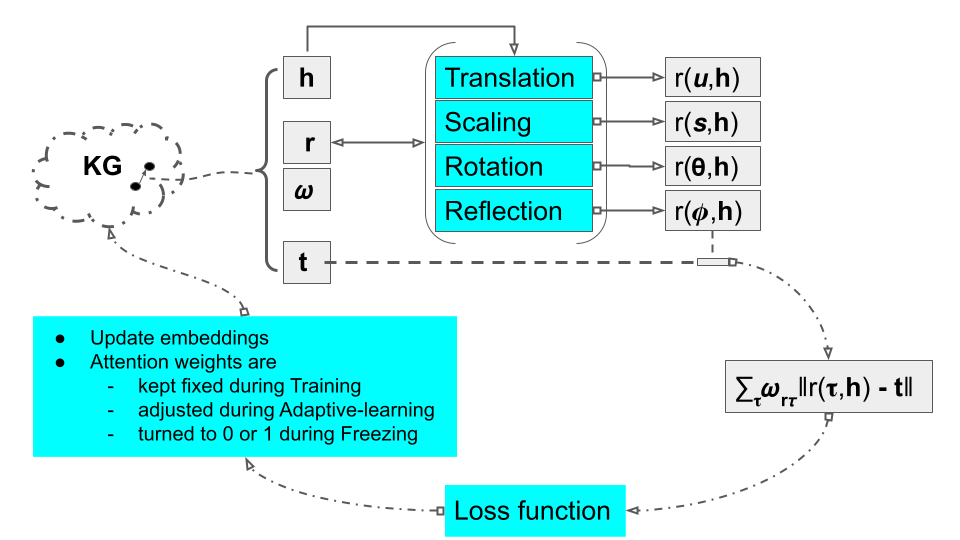

<div align="center">

# SMART: Specific Ranking of Elementary Geometric Transformations for Knowledge Graph Completion
</div>

This is the PyTorch implementation of SMART. SMART is developed in the [Rotate3D framework](https://github.com/gao-xiao-bai/Rotate3D) , to which we refer the users for more details.  

## Overview
SMART is a knowledge graph embedding model (KGE) that can learn relation-specific elementary geometric transformations (EGTs.) 
The EGTs  supported by SMART are translation, rotation, reflection, and scaling. 
Each relation is mapped to one of those EGTs. 
This is achieved by a 3-step approach for KGEs: training, adaptive learning and freezing. 
In the training phase, all EGTs contribute equally to each relation which allows the embeddings to form. 
In the adaptive learning phase, attention scores to the EGTs per relation are adapted. 
Finally, during freezing a hard selection of an EGT per relation is performed and the model continues to improve with this particular EGT.



## Link Prediction

This command train the SMART model on FB15k-237 dataset with GPU 0.
```
CUDA_VISIBLE_DEVICES=0 python -u codes/run.py --do_train \
 --cuda \
 --do_valid \
 --do_test \
 --data_path data/FB15k-237 \
 --model smart \
 -n 256 -b 256 -d 800 \
 -g 6.0 -a 1.0 \
 -lr 0.0001 --max_steps 260000 \
 --test_batch_size 16 -reg 0  -p 2 \
 --pretraining_steps 120000 --training_steps 50000 \
 --finetuning_steps 90000 \
```

The maximum step (max_steps) is set to the sum of pretraining_steps, training_steps and finetuning_steps, which 
are the number of iterations during the training, adaptive learning and freezing phases, respectively.
The run.sh script provides an easy way to search for hyperparameters or to evaluate the model on the KG benchmark datasets:

    bash run.sh train smart FB15k-237 0 0 256 256 800 6.0 1.0 0.0001 260000 16 0 2 120000 50000 90000

## Citation
```
@inproceedings{
  key,
  title={},
  author={},
  booktitle={},
  pages={},
  year={}
}
```
